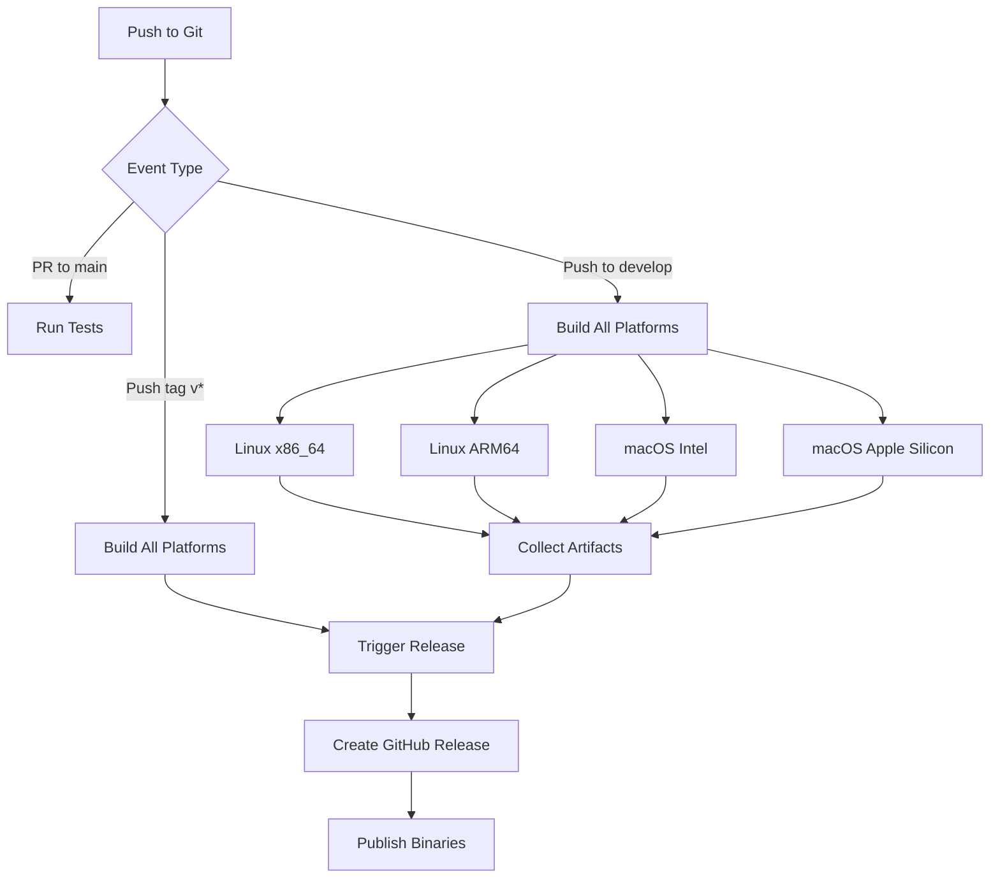

# GitHub Actions CI/CD Setup Guide

Complete guide to setting up and using GitHub Actions for automatic GCTA static binary builds.

## 📋 Overview

The workflow structure enables:

1. **Automatic Builds** on push/PR to main branches
2. **Release Builds** on version tags
3. **Manual Builds** via GitHub Actions UI or CLI
4. **Binary Distribution** through GitHub Releases

## 🏗️ Workflow Structure

```
.github/workflows/
├── README.md                    # Workflow documentation
├── build-linux-x86_64.yml       # Linux x86_64 build
├── build-linux-arm64.yml        # Linux ARM64 build
├── build-macos-intel.yml        # macOS Intel build
├── build-macos-arm64.yml        # macOS Apple Silicon build
├── build-all-platforms.yml      # Master orchestrator
└── release.yml                  # Release creation
```

## 🚀 Quick Start

### Step 1: Enable GitHub Actions

Actions are usually enabled by default. Verify:

1. Go to GitHub repository
2. Navigate to **Settings → Actions → General**
3. Ensure "Allow all actions and reusable workflows" is selected
4. Save

### Step 2: Push Workflows to Repository

```bash
cd /path/to/gcta
git add .github/workflows/
git commit -m "Add GitHub Actions CI/CD workflows"
git push origin feature-recessive  # or your branch
```

### Step 3: Create Initial Build

Push to develop/main branch to trigger builds:

```bash
git push origin main
# or
git checkout main && git merge feature-recessive && git push
```

View builds at: `https://github.com/jianyangqt/gcta/actions`

### Step 4: Create Release (Optional)

Tag and push to trigger automatic release:

```bash
# Create version tag
git tag v2.1.0
git push origin v2.1.0

# GitHub Actions will:
# 1. Build all platforms
# 2. Create release with binaries
```

View release at: `https://github.com/jianyangqt/gcta/releases`

## 📊 Build Workflows

### Linux x86_64 Build

**What it does:**
- Installs build tools (gcc, cmake, gfortran)
- Downloads Intel MKL
- Compiles dependencies (Eigen, Boost, zlib, zstd, GSL, SQLite)
- Builds static GCTA binary
- Generates MD5/SHA256 checksums

**Triggered by:**
- Push to master/main/develop
- Pull request to master/main
- Push of v* tags
- Manual dispatch

**Time:** ~60-90 minutes  
**Output:** `gcta64_linux_x86_64` binary with checksums

### Linux ARM64 Build

**What it does:**
- Compiles OpenBLAS for ARM64
- Builds all dependencies
- Creates static ARM64 binary
- Note: Currently cross-compiles from x86_64

**Triggered by:**
- Same as Linux x86_64

**Time:** ~60-90 minutes  
**Output:** `gcta64_linux_arm64` binary with checksums

### macOS Intel Build

**What it does:**
- Uses macOS 12 runner (Intel)
- Installs Homebrew dependencies
- Installs Intel MKL via Homebrew
- Builds static dependencies
- Creates macOS Intel binary

**Triggered by:**
- Same as Linux x86_64

**Time:** ~50-80 minutes  
**Output:** `gcta64_macos_intel` binary with checksums

### macOS Apple Silicon Build

**What it does:**
- Uses macOS latest runner (Apple Silicon)
- Compiles OpenBLAS for ARM64
- Builds dependencies
- Creates native ARM64 macOS binary

**Triggered by:**
- Same as Linux x86_64

**Time:** ~40-70 minutes  
**Output:** `gcta64_macos_arm64` binary with checksums

### Release Workflow

**What it does:**
- Collects artifacts from all builds
- Generates combined checksums
- Creates GitHub Release
- Uploads binaries and documentation

**Triggered by:**
- Push of v* tags (automatic)
- Manual dispatch

## 🎯 Common Tasks

### Monitor a Build

1. Go to **Actions** tab
2. Click on workflow run
3. View real-time logs

### Download Build Artifacts

**Via GitHub Actions UI:**
1. Go to **Actions → [Workflow Name]**
2. Click most recent successful run
3. Download from **Artifacts** section

**Via GitHub CLI:**
```bash
# List recent runs
gh run list --workflow build-linux-x86_64.yml --limit 5

# Download artifact
gh run download <run_id> -n gcta64_linux_x86_64
```

### Troubleshoot Failed Build

1. Click on failed workflow
2. Expand failed step logs
3. Check error messages
4. Common issues:
   - Missing dependencies (check dependency build step)
   - Out of disk space (unlikely on GitHub runners)
   - Network timeouts (rare, check URLs in scripts)

### Manually Trigger Specific Build

```bash
# Trigger single platform
gh workflow run build-linux-x86_64.yml

# Trigger all with selection
gh workflow run build-all-platforms.yml \
  -f build_type=linux-x86_64
```

### Create Custom Release

```bash
# Trigger release workflow manually
gh workflow run release.yml \
  -f release_tag=v2.1.0
```

## 📦 Release Creation

### Automatic Release (Recommended)

```bash
# Create and push tag
git tag -a v2.1.0 -m "Release v2.1.0"
git push origin v2.1.0

# GitHub Actions will:
# 1. Trigger all builds automatically
# 2. Wait for artifacts
# 3. Create release with all binaries
```

### Manual Release

If builds completed but release not created:

```bash
gh workflow run release.yml -f release_tag=v2.1.0
```

### Release Contents

Each release includes:
- **gcta64_linux_x86_64** - Linux x86_64 binary
- **gcta64_linux_arm64** - Linux ARM64 binary
- **gcta64_macos_intel** - macOS Intel binary
- **gcta64_macos_arm64** - macOS Apple Silicon binary
- **CHECKSUMS.md** - Combined checksums
- **Release notes** with build information

## ⚙️ Configuration

### Modify Build Parameters

Edit workflow files to customize:

**Change build trigger:** Edit `on:` section
```yaml
on:
  push:
    branches:
      - master
      - main
      - develop
```

**Change artifact retention:** Edit artifact upload step
```yaml
retention-days: 30  # Change as needed
```

**Disable specific platform:** Comment out in `build-all-platforms.yml`
```yaml
# call-build-linux-arm64:
#   name: Linux ARM64 Build
#   ...
```

### Secrets Management

These workflows use only:
- `GITHUB_TOKEN` (automatically provided)

No sensitive credentials required!

## 🔐 Security Considerations

- ✅ No hardcoded credentials
- ✅ Artifacts uploaded to GitHub (encrypted in transit)
- ✅ Release artifacts publicly available (expected)
- ✅ Workflows run in isolated environments
- ✅ Source code not included in binaries

## 📈 Monitoring & Analytics

### View Workflow Statistics

```bash
# Get workflow runs
gh run list --workflow build-linux-x86_64.yml

# Get specific run details
gh run view <run_id>

# Check log output
gh run view <run_id> --log
```

### Track Build Times

Monitor performance over time by:
1. Recording completion times from workflow runs
2. Identifying long-running steps
3. Optimizing dependency compilation if needed

## 🛠️ Troubleshooting

### "Intel MKL not found" (Linux x86_64)

The automated MKL download might fail due to:
- Network issues
- URL changes
- Disk space limitations

**Solution:**
1. Check workflow logs for exact error
2. Manual download and setup may be needed for CI
3. Consider using system MKL if available

### "ARM64 binary runs on x86_64"

Linux ARM64 workflow currently cross-compiles. The binary produced will be ARM64, but:
- It will fail on x86_64
- Must be verified on actual ARM64 hardware
- Works when copied to ARM64 systems

### Workflow Stuck/Timeout

Default timeout: 120 minutes

If hitting timeout:
1. Increase timeout in workflow file
2. Optimize build scripts
3. Reduce parallel compile jobs

### Artifact Upload Fails

Ensure:
1. Binary was actually built
2. Artifact path is correct
3. File permissions allow reading

## 📚 Documentation

- **[.github/workflows/README.md](./.github/workflows/README.md)** - Detailed workflow reference
- **[docs/build/README.md](docs/build/README.md)** - Build scripts documentation
- **[docs/build/QUICK_START.md](docs/build/QUICK_START.md)** - Quick build reference

## 🔄 CI/CD Pipeline Flow



## 🚀 Next Steps

1. **Push workflows:**
   ```bash
   git add .github/workflows/
   git commit -m "Add GitHub Actions CI/CD"
   git push
   ```

2. **Test first build:**
   - Push to develop branch
   - Monitor in Actions tab
   - Verify all 4 platforms complete

3. **Create first release:**
   ```bash
   git tag v2.1.0
   git push origin v2.1.0
   ```
   - Wait for all builds
   - Check GitHub Releases
   - Download and verify binaries

4. **Update README:**
   Add build status badges to main README.md:
   ```markdown
   [](https://github.com/jianyangqt/gcta/actions)
   ```

## 📞 Support

- Check workflow logs for detailed error messages
- Review [docs/build/QUICK_START.md](docs/build/QUICK_START.md) for common issues
- Visit [GitHub Actions Docs](https://docs.github.com/en/actions) for API reference

---

**Last Updated:** February 2026  
**Status:** ✅ Production Ready
